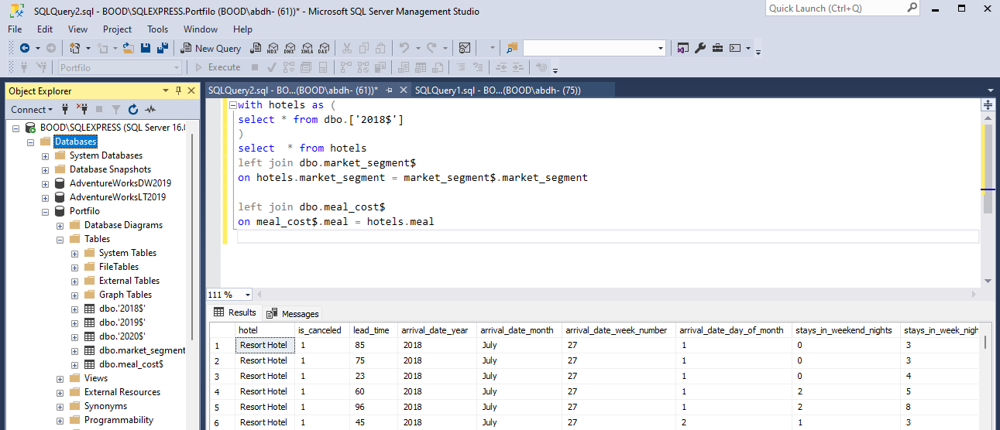
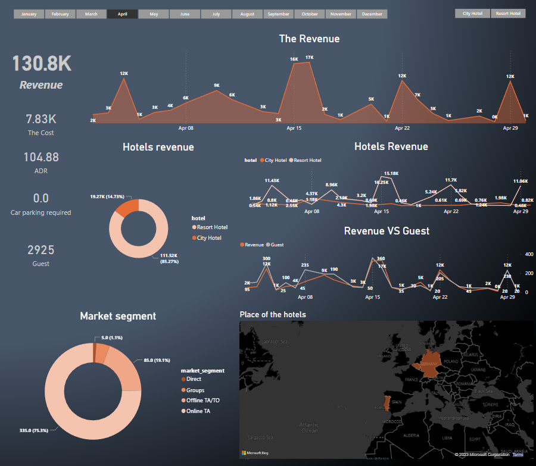

# 5 - hotel_revenue
--------------------

--------------------
## Introduction

The owner has two types of hotels across the world and he wants to see the statics of his business, he gets tired of the Excel files he received from his employer so he heard about BI tools and wants to see the hotel's data as a dashboard.
------------------
## Problem Statement
I want to know the Revenue of all hotels by month, country, and type of hotel, and the same for Cost, ADR, and guests, and add the location for every single one, and if you can add anything you find helpful, and just the 2018 data only.
--------------------------
### TOOLS
- MICROSOFT SQL Server MANAGEMENT STUDIO
- MICROSOFT EXCEL
- MICROSOFT POEWR BI
----------------------------
## Data Sourcing
The data is from a content creature

### About the data : 
the data is a collection of multiple Excel spreadsheets from a database it shows the data from 2018 to 2020
-----------------
## Cleaning & Analysis
1- Create a database for this dataset to use the power of SQL freely

2 – After creating the database I develop a SQL Query to merge some tables (left join).

------------------
3 - Develop a SQL Query in Power BI(measures) to calculate the:
-	Parking percentage measure 
Parking percentage = sum(Query1[required_car_parking_spaces])/[Totle nighit]

-	Totle night measure
Totle night : SUM(Query1[stays_in_week_nights])+SUM(Query1[stays_in_weekend_nights])

## Data Transformation
### Using the BI Query to transform the required data to Power BI
-------------------
with hotels as (

select * from dbo.['2018$']

)

select  * from hotels

left join dbo.market_segment$

on hotels.market_segment = market_segment$.market_segment

left join dbo.meal_cost$
on meal_cost$.meal = hotels.meal

--------------

## Modeling
### No modeling was required since we need just a table for the analysis.

## The dashboard

--------------------
# Thank you

